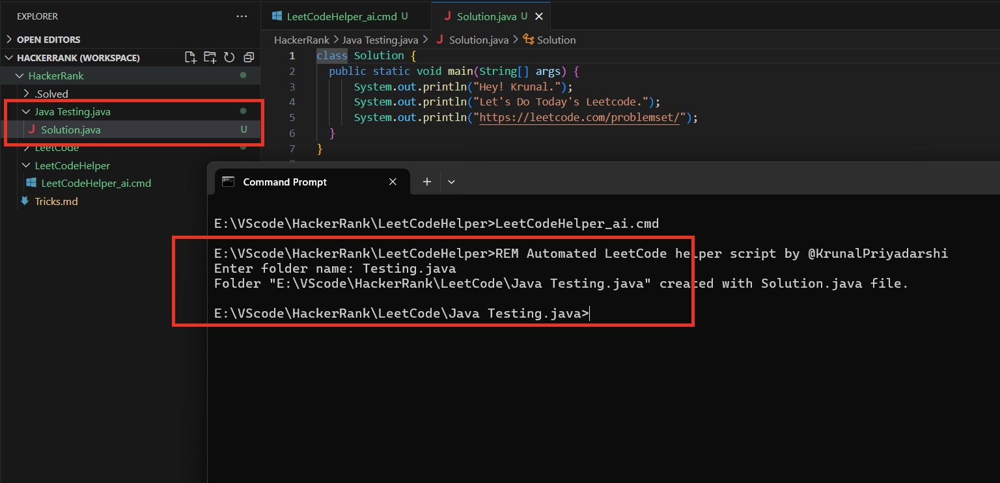

# LeetCode Script Automation

This script automates the process of creating a folder and a Java file for solving LeetCode problems.

## Usage

1. **Run the Script**: 
   - Open Command Prompt (CMD) and navigate to the directory containing the script file.
   - Run the script by typing `LeetCodeHelper_ai.cmd` and pressing Enter.
   - Follow the prompts to enter the folder name.
     
     

2. **Generated Files**:
   - The script will create a folder with the specified name under `E:\VScode\HackerRank\LeetCode\`.
   - Inside the folder, it will generate a Java file named `Solution.java` containing basic template code.
    

## Requirements

- This script requires Windows operating system.
- You need to have Command Prompt (CMD) or PowerShell installed on your system.

## Contributing

Contributions are welcome! If you have suggestions, improvements, or encounter any issues, feel free to open an issue or create a pull request.
